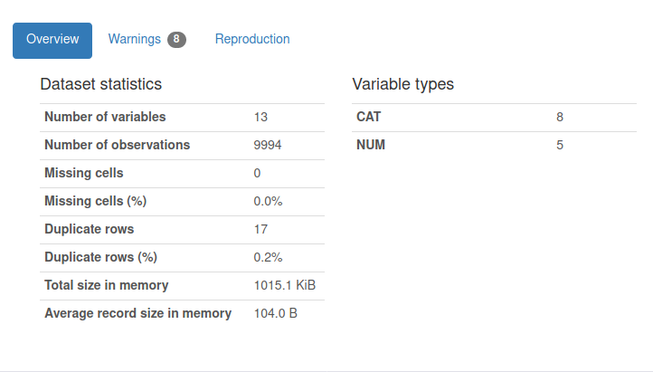
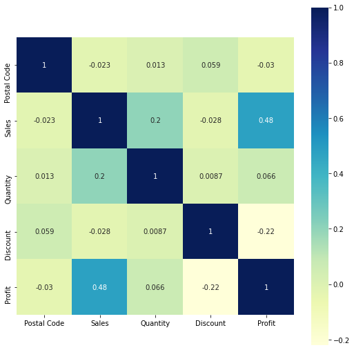

# Exploratory Data Analysis (EDA) on Sample Super Store

   This project is part of my internship, we have data of world's famous Sample Super Store. Our job is identify weak areas for this store and create interactive dashboard with the help of EDA.
   

## Table of Contents
* Quick Overview on Dataset(#quick-overview-on-dataset)

## Quick Overview on Dataset
   Rather than checking for missing values, dublicate values, scatter plots and feature data types explicitly, I used profiling libaries like DataPrep and Pandas-Profiling. as they are quick and aims to give detailed information about dataset. 
 ### Have a look
  It shows that there is 8 categorical and 5 numeric features, no missing values, and 17 duplicate rows. At the same time it also showed that **Country** column is constant, therefore it's just taking up space in our dataset. 
  
   
  
### Heat Map
  One of the most surprize thing happened here. The correlation between Quantity and Profity is hardly 0.066 which means even if consumer purchase tond of products it's not going to increase the profit in sense. Even after splitting the data by sub-category result remains the same. And fot the postal-code all the values are very close to zero. we can remove it without any hesitation.
 
 
 Now we have cleaned data and we are ready build interactive dashboard.
 
## Dashboard
I've used **jupyter notebook** and **Voila** to create interactive dashboard. I know it's not as cool as creating by Tablue, but it's also a good compititor and very light to use. And **Heroku** for the deployment. You can click below heroku icon or click [here](https://samplestore101.herokuapp.com) to see the dashboard on your fingertips. It might take upto 5 miniutes to load.

## Conclusion
Ares where Demand is greater than the Profit
   * Central Region
   * Technology Category
   * Furniture Category
   * Art % Furnishing Sub-Category
   
Ares with worst performance
   * Texas State (9% Total loss)
   * Philadelphia City (5% Total loss)
   * Tables (6.2% Total loss)
   
Best Performance areas
   * Standard Class as Shipping Mode
   * West Region (37.82% Profit along with 31.94% Demand)
   * Phones as Sub-Category

## Notebooks
* EDA Notebook
* Dashboard Notebook

## Project Dependencies
* Jupyter Notebook
* Python Libraries
   * Voila
      * Voila-material
   * Plotly
   * Matplotlib
   * Seaborn
   * Pandas
      * Pandas-Profiling
   * DataPrep
 * Heroku
 * and a machine to run all these
 
