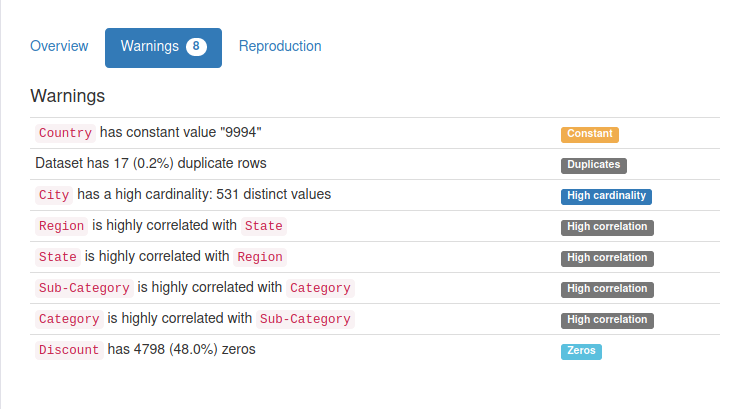

# Exploratory Data Analysis (EDA) on Sample Super Store

   This project is part of my internship, we have data of world's famous Sample Super Store. Our job is identify weak areas for this store and create interactive dashboard with the help of EDA.
   

## Table of Contents
* Quick Overview on Dataset(#quick-overview-on-contents)

## Quick Overview on Dataset
   Rather than checking for missing values, dublicate values, scatter plots and feature data types explicitly, I used profiling libaries like DataPrep and Pandas-Profiling. as they are quick and aims to give detailed information about dataset. 
 ### Have a look
  It shows that there is 8 categorical and 5 numeric features, no missing values, and 17 duplicate rows. At the same time it also showed that Country column is constant, therefore it's just taking up space in our dataset.
  
   
  
